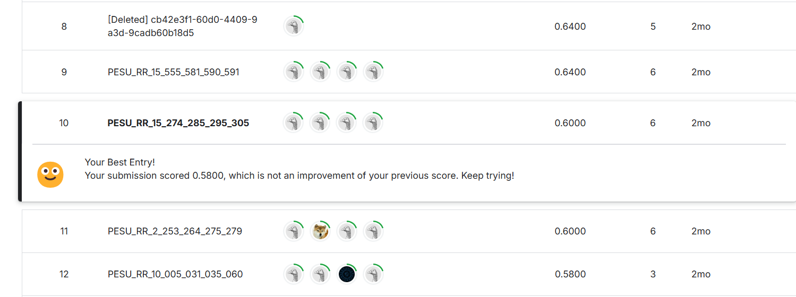

# Emotion Detection using Multimodal Fusion

## Overview

This project was developed during the **Machine Learning Hackathon 2024**, where we tackled the challenge of building a multimodal fusion model for emotion detection. Using data from the popular TV series *Friends*, the goal was to classify emotions from video and subtitle data into five categories: **anger**, **joy**, **neutral**, **sadness**, and **surprise**.

We explored both textual and visual modalities, combining them through fusion techniques to create a robust emotion detection system.

## Achievements

Our team secured **10th place** in the hackathon.  

## Highlights

- **Multimodal Approach**: Combined text and video data to improve emotion classification.
- **Fusion Techniques**: Experimented with early and late fusion for feature integration.
- **Comprehensive Analysis**: Utilized visual, audio, and textual features for predictions.

## Tools and Technologies

- Frameworks: TensorFlow, PyTorch.
- Techniques: Natural Language Processing (NLP), Computer Vision, Feature Fusion.

## Acknowledgments

Grateful to the Machine Learning Hackathon organizers and team members for providing this incredible learning opportunity.
